# YTM, Spot Rate, and Forward Rate

## 流程圖

    

## 程式執行

### 0. 測試環境

|  | Environments 1 | Environments 2 |
| ------------- | ------------- | ------------- |
| Operation System | macOS Catalina | Ubuntu 19.10 |
| Language | python 3.7.4 | python 3.7.5 |

### 1. 安裝套件

    $ pip3 install -r requirements.txt

### 2. 執行程式

一、綜合計算（YTM + Spot Rates + Forward Rates）

    $ python3 hw2_all.py
    
二、個別計算

計算 YTM 
    
    $ python3 hw2_ytm.py

計算 Spot Rate I 
([Trignosource: Spot Rate](https://www.trignosource.com/finance/spot%20rate.html))

    $ python3 hw2_spot_rate_1.py

計算 Spot Rate II 
([綠角財經筆記](http://greenhornfinancefootnote.blogspot.com/2010/06/how-to-compute-theoretical-spot-rates.html))

    $ python3 hw2_spot_rate_2.py

計算 Forward Rate I
([Trignosource: Forward Rate](https://www.trignosource.com/finance/Forward%20rate.html))

    $ python3 hw2_forward_rate_1.py

計算 Forward Rate II
([綠角財經筆記](http://greenhornfinancefootnote.blogspot.com/2010/08/how-to-compute-forward-rates-from.html))

    $ python3 hw2_forward_rate_2.py
