# Binomial Option Pricing Model (BOPM)

## 流程圖

    

## 程式執行

### 0. 測試環境

|  | Environments 1 | Environments 2 |
| ------------- | ------------- | ------------- |
| Operation System | macOS Catalina | Ubuntu 19.10 |
| Language | python 3.7.4 | python 3.7.5 |

### 1. 安裝套件

    $ pip3 install -r requirements.txt

### 2. 執行程式
1. 逐步計算

    $ python3 BOPM1.py

2. 公式計算

    $ python3 BOPM2.py

### 3. 檔案位置

| 學習歷程 | 流程圖 | 程式碼（逐步計算）| 程式碼（公式計算）
| ------------- | ------------- | ------------- | ------------- |
| [學習歷程.ipynb]() | [流程圖.svg]() | [BOPM1.py]() | [BOPM2.py]() |